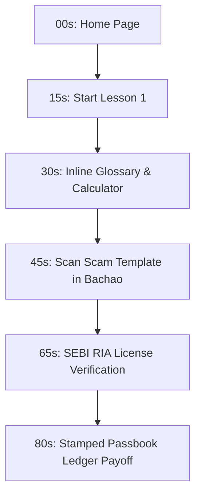

# SafalNiveshak (सफल निवेशक) — Financial Trust & Safety Ledger

SafalNiveshak is an educational safety simulator, verification ledger, and bilingual classroom built for first-time retail investors in India. It aims to protect capital against unregistered VIP chat tips, fraudulent WhatsApp pump-and-dump loops, and jargon-heavy marketing traps.

Designed with a premium, passbook-inspired ink-navy grid, the application operates **100% offline-first** to guarantee zero-crash live demos during hackathon judging rounds.

---

## 🛠️ The Tech Stack (100% Free & Open-Source)

*   **Frontend**: React 19 + Vite + Vanilla CSS (responsive grid layout, standard 4px ledger corner styling, tabular monospace numeric fields).
*   **Audio Narration**: Web Speech API (`window.speechSynthesis`) — browser-native text-to-speech that operates completely offline and supports local Hindi (`hi-IN`) and English voice profiles.
*   **Backend Server**: Node.js + Express.js.
*   **Database Persistence**: SQLite 3 (`safalniveshak.db`) — local file-based database for registered advisory whitelist lookup, lesson credits tracking, track clearance certification stamps, and inspected check logs.
*   **Optional AI Layer**: Google Gemini API (Generative Language API) free tier — invoked as a fallback-safe background task. If the server is offline or the Gemini quota is exceeded, the scanner falls back to local rules dynamically without lagging.

---

## 📊 Database Schema Details (`safalniveshak.db`)

1.  `sebi_advisors`: Registration whitelists (`regNo`, `name`, `type`, `validTill`, `email`, `address`, `status`). Seeding automatically occurs on the first backend boot.
2.  `lesson_progress`: Track reading progress logs (`userId`, `lessonId`, `completedAt`).
3.  `completed_tracks`: Verified track assessment stamps (`userId`, `trackId`, `completedAt`).
4.  `scam_records`: Persists logs of inspected message checks (`userId`, `textSnippet`, `score`, `verdict`, `date`).

---

## 🛡️ Live Demo Pacing Script (60–90 Seconds)

Judges give you 2-3 minutes. This script is designed to demonstrate every high-impact moment with zero manual typing:



### 1. The Safety Hook (00s – 15s)
*   **Action**: Land on the Home screen. Toggle the language switch **EN ➔ हि** in the top right to show the bilingual registry header. Toggle it back to **EN**.
*   **Pitch**: *"Every day, first-time Indian investors lose crores to anonymous WhatsApp forwards and unregulated stock tips. SafalNiveshak is an offline-safe financial shield and stamped passbook ledger to protect retail capital."*

### 2. The Learning Route & Woven Calculator (15s – 35s)
*   **Action**: Click the gold `📖 Start Lesson` button.
    - Click **Lesson 01** on the dashed ticket stub.
    - Click the **Play Voice** button to demonstrate the offline text-to-speech audio reader.
    - Scroll slightly to highlight the inline **Inflation Eraser Calculator**. Enter ₹50,000 to show the required future capital shrinking to ₹20,833 at 6% inflation.
*   **Pitch**: *"Our classroom collapses into a collapsed pathway breadcrumb, showing lessons as nodes on a ticket stub. Concepts are taught without jargon—terms like inflation are cross-linked inline via dictionary popups, and calculators are woven directly into the text."*

### 3. The Scam Dial & Official Verdict (35s – 55s)
*   **Action**: Click **Bachao (Scam Shield)** in the header.
    - Click the first sandbox template button (**"VIP Telegram Pump & Dump"**).
    - Watch the galvanometer pointer needle shake and sweep, and see the red **`❌ FRAUD SUSPECT`** double-border stamp apply.
*   **Pitch**: *"If a user gets a tip, they paste it here. Our rule engine scans 10 categories of red flags—like guaranteed returns or VIP telegram links—and rates risk on a galvanometer dial, stamping the verdict mechanically."*

### 4. Advisor Verification (55s – 70s)
*   **Action**: Click the green **`Check License Number`** button underneath the scan findings.
    - Search for **"Groww"** in the input field. See the registry database instantly filter and show the registration license number `INA100009230` marked as **`ACTIVE / VERIFIED`**.
*   **Pitch**: *"Scammers routinely steal advisor names. Users can instantly crosscheck license numbers or advisory domains against our local SEBI register database."*

### 5. Stamped Passbook Payoff (70s – 90s)
*   **Action**: Click **Passbook** in the navbar.
    - Show the judges the formatted bank passbook containing custom stamps (`★ Passed` and `⚠ Blocked`) alongside tabular monospace codes (`EDU-LN01`, `SCAM-CHK`) matching the exact transactions performed during the demo.
*   **Pitch**: *"Everything the investor does is logged on a physical passbook ledger, turning safety actions into stamped credit logs. The system runs completely free, offline, with zero external hosting dependencies."*

---

## 🚀 Setting Up & Running Locally

1.  **Clone & Install Dependencies**:
    ```bash
    npm install
    ```
2.  **Start API Server** (Port `5000`):
    ```bash
    node server/server.js
    ```
3.  **Start Vite Frontend** (Port `5173`):
    ```bash
    npm run dev
    ```
4.  **Open in browser**: Visit `http://localhost:5173`.
